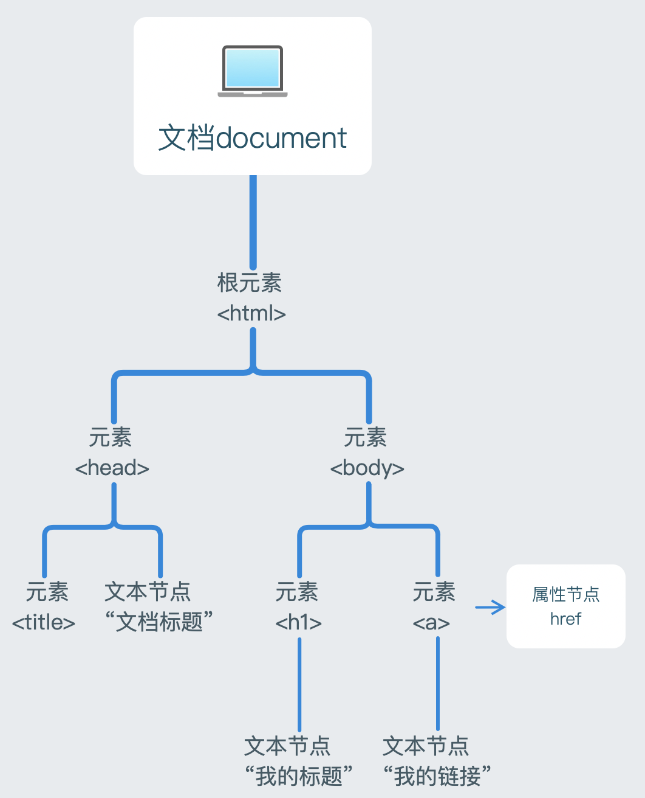

##### DOM

document object model

顶层对象document

文档对象模型，结构图如下：

==节点类型nodeType== 返回数字

元素节点 1 标签

属性节点 2 他们的属性

文本节点 3 他们的文本 text

注释节点 8 comment

文档节点 9 document

获取属性节点

e.g. element.getAttributeNode(“width”)  行间属性

获取文本节点

e.g. span.firshChild

==节点名称nodeName== 元素节点返回大写标签名(string类型);属性节点返回属性名;文本节点返回#text

==节点内容nodeValue== 属性节点的为属性值，文本节点的为文本内容，元素节点的为null

==节点关系==

父子关系：上下级

兄弟关系：同级

祖先关系：当前节点上面所有节点统称

子孙关系：当前节点下面所有节点统称

想拿到所有后代用 祖先.getElementsByTagName(“”);

==定位祖先节点==

element.offsetParent 距离元素最近的有定位属性的祖先节点

如果祖先都没有定位，那么会获取到body

==儿子节点==

childNodes：获取一个元素下的所有子节点(只获取到儿子一级)，包括文本节点、注释节点

children：获取一个元素下的所有子**元素节点** (只获取到儿子一级)

firstChild：获取第一个子节点(包括三种节点)

lastChild：获取最后一个子节点(包括三种节点)

==父亲节点==

parentNode：获取一个元素的父节点(一定是元素节点)

==兄弟节点==

nextSibling：获取当前元素的下一个兄弟节点(包括元素、文本、注释节点)

nextElementSibling：获取当前元素的下一个兄弟元素节点

previousSibling：获取当前元素的上一个兄弟节点(包括元素、文本、注释节点)

previousElementSibling：获取当前元素的上一个兄弟元素节点

获取不到节点返回null

==创建节点==

父节点.appendChild(element)

父节点.insertBefore(insertElement,beforeWhichElement) 待插入元素，要插到哪个元素之前f

若第二个参数为null(相当于父亲没有儿子)，则直接插入，此时效果通appendChild

法一：

var son = document.createElement(“标签名字”)

son.innerHTML=val

father.appendChild(son)

法二：

father.innerHTML += “\<li>” + val + “\</li>”

==替换节点==

father.replaceChild(newElement,oldElement) 应该先判断oldElement是否存在

==删除节点==

father.removeChild(element)

自己(要删的元素).remove()

##### 获取位置

> **offsetLeft 元素距离定位祖先(offsetParent)的左偏移值**

包括left、padding、margin造成的偏移，都计算进来，获取的值不带单位但指的是px

这个属性只能读，不能写

想获取偏移位置，课用offset，用left无法获取到padding和margin之类的位置

> **offsetTop 元素距离定位祖先(offsetParent)的上偏移值**

==祖先都没有定位属性时，则相对body来算位置==

没有offsetRight和offsetBottom

##### 可视区

document.documentElement 获取到整个html即root

浏览器可视区尺寸可用clientWidth，clientHeight

clientHeight 

clientWidth **内容+内边距(padding)**

offsetHeight

offsetWidth **内容+内边距(padding)+边框+滚动条宽度**

scrollHeight

scrollWidth **内容+内边距(padding)+任何溢出内容的尺寸,不包括内边距和边框**

function view(){

return {

​    w:document.documentElement.clientWidth,

​    h:document.documentElement.clientHeight

}

}

width = view().w

height = view().h