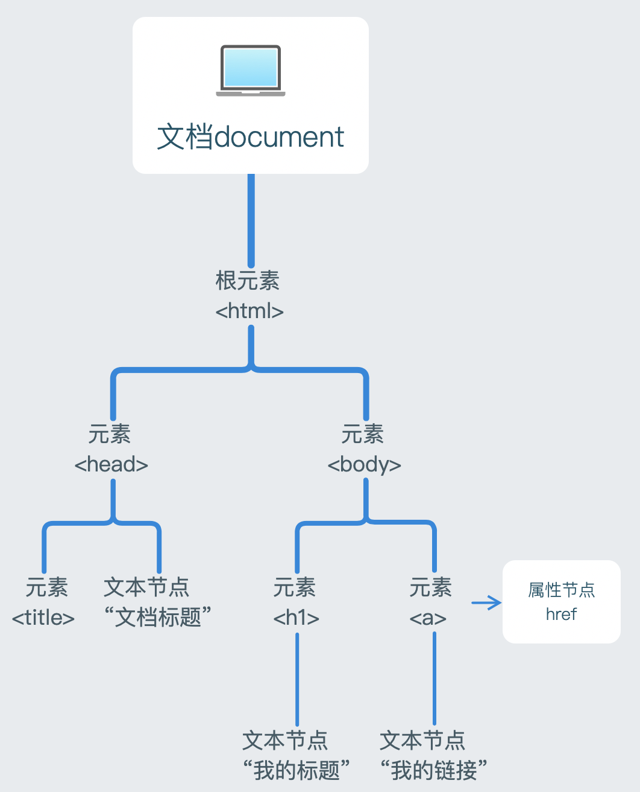

##### DOM

document object model

顶层对象document

文档对象模型，结构图如下：





document.documentElement 获取到整个html即root


==节点类型nodeType== 返回数字

元素节点 1 标签

属性节点 2 他们的属性

文本节点 3 他们的文本 text

注释节点 8 comment

文档节点 9 document


获取属性节点

e.g. element.getAttributeNode(“width”)  行间属性


获取文本节点

e.g. span.firshChild


==节点名称nodeName== 

元素节点返回大写标签名(string类型);属性节点返回属性名;文本节点返回#text


==节点内容nodeValue== 

属性节点的为属性值，文本节点的为文本内容，元素节点的为null


==节点关系==

父子关系：上下级

兄弟关系：同级

祖先关系：当前节点上面所有节点统称

子孙关系：当前节点下面所有节点统称


想拿到所有后代用 `祖先`.getElementsByTagName(“”);


==定位祖先节点==

element.offsetParent 距离元素最近的有定位属性的祖先节点

如果祖先都没有定位，那么会获取到body


==儿子节点==

childNodes：获取一个元素下的所有子节点(只获取到儿子一级)，包括文本节点、注释节点

children：获取一个元素下的所有==子**元素节点**== (只获取到儿子一级)

firstChild：获取第一个子节点(包括三种节点)

lastChild：获取最后一个子节点(包括三种节点)


==父亲节点==

parentNode：获取一个元素的父节点

parentElement 不好用 只在ie可用


==兄弟节点==

nextSibling：获取当前元素的下一个兄弟节点(包括元素、文本、注释节点)

nextElementSibling：获取当前元素的下一个兄弟元素节点

previousSibling：获取当前元素的上一个兄弟节点(包括元素、文本、注释节点)

previousElementSibling：获取当前元素的上一个兄弟元素节点

获取不到节点返回null


==创建节点==

父节点.appendChild(element)

父节点.insertBefore(insertElement,beforeWhichElement) 待插入元素，要插到哪个元素之前f

若第二个参数为null(相当于父亲没有儿子)，则直接插入，此时效果同appendChild


法一：

var son = document.createElement(“标签名字”)

son.innerHTML=val

father.appendChild(son)

法二：

father.innerHTML += “\<li>” + val + “\</li>”


> 针对子节点ChildNode的接口 都是插入到父亲底下,和son同级

son.before(xx) 将xx插入到son之前\<xx>\<son>

son.after(yy) 将yy插入到son之后\<son>\<yy>


==替换节点==

father.replaceChild(newElement,oldElement) 应该先判断oldElement是否存在

son.replaceWith(newElement) | p.replaceWith(span)


==删除节点==

- father.removeChild(element)

- 要删的元素本身.remove()


##### 你可能不知道的坑💣

HTMLCollection <font color="dark">**V.S**</font> NodeList


相同点: 

- 这两者都是伪数组，真对象

- 这两者都是动态的，若dom发生了变化，之前获取到的HTMLCollection或NodeList也会随之变化

- 两者都有item方法，可以通过索引来获取到数组中的元素，如collection.item(0)

  HTMLCollection的item方法参数只能为数字,代表索引；

  NodeList的item方法参数只能为数字,代表索引。


区别:

- HTMLCollection包含的是元素节点Element，NodeList顾名思义包含的是所有类型的节点(包括文本节点|属性节点|注释节点等等)

- HTMLCollection多了一个namedItem方法，参数可以为id或name(表单元素的name)，若id与name同名，以id优先。

- 通过querySelectorAll方法返回的是NodeList 这个方法返回的内容很全

  通过getElementsByXXX方法返回的是HTMLCollection 方法名都告诉你了 getElements

  所以只返回元素节点


==重点来了==

HTMLCollection和NodeList都是动态的，具有实时性。

通过getElementsByxxx 返回的集合是动态的 实时的

But,通过querySelectorAll 返回的集合却是静态的 不具有实时性 (很特殊的一点)


举个🌰

```html
<body>
<div id="outer">
    <p class="p">我是1</p>
    <p class="p">我是2</p>
</div>

<script>
    let qps = document.querySelectorAll(".p");
    let gps = document.getElementsByClassName("p");
    let newp = document.createElement("p");
    newp.classList = 'p';
    newp.innerHTML = '我是3';
    outer.appendChild(newp);
    console.log(qps);
    console.log(gps);
</script>
</body>
```


qps打印出的是NodeList,里头只有**2个元素**

gps打印出的是HTMLCollection,里头有**3个元素**


>说明querySelector获取到的是当时的元素，后续的变化不会影响获取到的值了
>
>而getElementsByXXX获取到的是动态的值，后续的变化实时反应影响到值，使用的时候已经不是当时获取到的值了


所以按照需求选择方案

如果想安全点 不会受后面改变dom影响之前获取到的元素的使用的 就用querySelector


