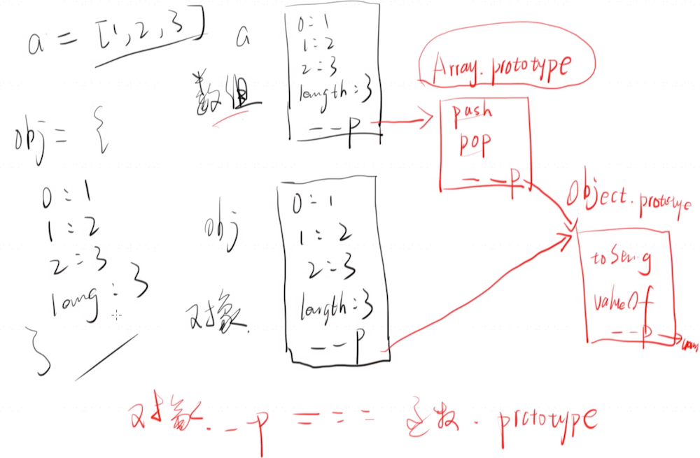

标准库：

JS栈内存，堆内存

栈内存：global全局对象地址，对应堆内存中的内容

window

标准库/非标准库

Object() Number() String() Boolean()

简单数据类型，number string boolean

new Number()与Number()的区别是

带new的返回一个复杂类型(Number{1})，不带new的返回一个基本类型(1)。

复杂数据类型，object array function

带不带new，一样，返回的都是复杂类型

## Array

Array是全局对象。

两种用法：

1. var arr = new Array(3)

   生成了一个包含三个undefined的数组

2. var arr = new Array(1,2,3)

   生成数组[1,2,3]，相当于var arr=[1,2,3]

不一致性

数组的定义：

对我们来说：一组有序的值的组合

对JS来说：由构造函数Array构造出来的对象

数组和对象的本质区别，他们由不同的构造函数构造而来，他们两者各自的公用属性是不一样的，有图有真相：

其实array也是对象，是一个拥有特殊原型链(不同于object)的对象。

遍历方式：

- for(let i=0;i<length;i++)
- for(let i in array)

伪数组：

原型链中没有Array.prototype这一环，没有push方法，则为伪数组。

函数参数列表，arguments为伪数组。

### 数组的API

==大部分把函数作为参数的都必须function(value,key)，带key和value参数，value在前==

reduce不是

> ##### forEach
>
> 无返回值,加return也没用
>
> 接收的函数第一个参数是value，第二个参数是key，第三个参数是数组自己(一般不写)

var arr = [1,2,3]

arr.forEach(function(x,y){

​    console.log(‘value’,x)

​    console.log(‘key’,y)

})

arr.forEach(function(x,y,self))

forEach函数接收函数

**实际上还传了参数自己，arr.forEach.call(arr,fn)，通过this获得了自己**

以上相当于：

function forEach(arr,fn){

​    for(let i=0;i<arr.length;i++){

​        //对应value,key

​        fn(arr[i],i);

​    }

}

forEach([1,2,3],function(value,key){

​    console.log(value,key)

})

> ##### sort 
>
> 默认为从小到大
>
> 调用后会改变原数组
>
> 传入的函数，return x-y | return y-x 记不住试一遍就可以

var arr = [1,2,3,4,5,6]

arr.sort() 从小到大排

arr.sort(function(x,y){return x-y})

arr.sort(function(x,y){return y-x})

以上两个，一个从小到大一个从大到小，忘记了一试便知

可以按对象的某个属性排序：

obj.sort(function(a,b){return a.value-b.value});

若数据内容为字符串，则按ascii码对应数字大小来排

var a = new Array("banna","Apple","orange","apple"); a.sort();  console.log(a) 

//输出 ["Apple","apple", "banna", "orange"] 

//比较函数缺省，按照字母顺序ascii码升序排序 A<a<b<o

> ##### reverse
>
> 颠倒数组中元素顺序，会改变原来的数组并返回，不创建新数组。

var a = [1,2,3,4,5,6,7];

a.reverse();

//输出[7,6,5,4,3,2,1]

> ##### join
>
> 给数组的值之间插入某个值
>
> 不传参的话，默认为用逗号‘,’来填充

==数组快速变字符串==

arr = [1,2,3]

arr.join(‘,’)

就变为“1,2,3”

> ##### concat 
>
> 连接两个东西

var a = [1,2,3]

var b = [4,5,6]

var c = a.concat(b) //[1,2,3,4,5,6]

==复制数组==

var a = [1,2,3]

var acopy = a.concat() | var acopy = a.concat([])

这时复制了一份数组，但是他们不是同一个数组，在内存不同区域

> ##### map
>
> 功能同forEach，但有返回值，不写return会默认以undefined为值的数组。

var a = [1,2,3]

a.map(function(value,key){

​    return value * 2;

})//输出[2,4,6]

更简洁的写法：

a.map(value=>value*2)

也可以return对象

return {

​    v:value,

​    k:key;

}

> ##### filter
>
> 过滤器

var a = [1,2,3,4,5,6,7,8,9,10];

a.filter(function(value,key){

​    return value>=5;

});

//返回数组 [5,6,7,8,9,10]

a.filter(function(value,key){

​    return value%2===0;

});

//返回[2,4,6,8,10]

💡tips：可以和map一起用，链式操作

var a = [1,2,3,4,5,6,7,8,9,10]

a.filter(function(value,key){

​    return value%2===0;

}).map(function(value,key){

​    return value*value;

})

//输出[4,16,36,64,100]

> ##### reduce
>
> 这个API中没有key，参数都是value
>
> 求和
>
> 第一个参数是需求函数，
>
> 需求函数的第一个参数是每一次运算后的结果，第二个参数是新加入运算的值
>
> 第二个参数是初始值。

var a = [1,2,3,4,5,6,7,8,9]

a.reduce(function(resule,n){

​    return result + n;

},0)

//输出45，为9个数之和

求和函数的第一个参数是总和，第二个参数是下次要增加的值

💡**用reduce可表示map，可表示filter**

###### reduce表示map

var a = [1,2,3]

a.reduce(function(result,n){

​    result.push(n*2);

​    return result;

},[]);

//输出[2,4,6]，把数组的值都乘以2然后输出了

###### reduce表示filter

var a = [1,2,3,4,5,6,7,8,9,10]

a.reduce(function(result,n){

​    if(n%2===0){

​        result.push(n);

​    }

​    return result;

},[]);

//输出[2,4,6,8,10]，过滤出了偶数

### Function

var fn = new Function([arg1,...argN],functionBody)

可不传参数，但要传函数体，都需要变为string格式

var fn = function(a,b){return a+b;};

var fn = new Function(‘a’,‘b’,‘return a+b’);

以上两者相同

function为关键字，声明函数，或表示函数类型

Function为构造函数

声明函数方式：

1. 具名函数

   function fn(){};

2. 匿名函数

   var fn = function(){};

3. 构造函数

   var fn = new Function(‘a’,‘return a’);