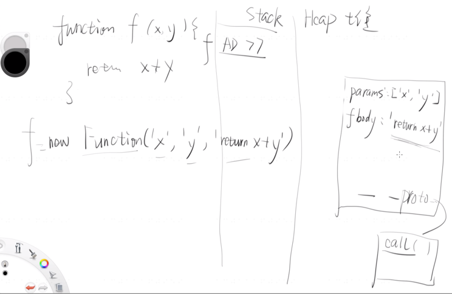

## JS中的函数

#### 函数5种声明方式

**①**function x(){};

**②**var x = function(){};

**③**var x = function y(){};

console.log(y);

//报错，识别不到y，因为y的作用于只在函数那一片区域

**④**var x = new Function(‘x’,‘y’,‘return x + y’)

**⑤**箭头函数：var x = (x,y)=>{return x+ y}

若只有返回值一句话，且返回的不是对象，可以把{}和return同时去掉

如：

var f = (x,y)=>x+y

var f = n=>n*n

---

#### 略变态的name

function fn(){}; f.name //“fn”

var f1 = function(){}; f1.name //“f1”

var f1 = function f2(){}; f1.name //“f2” | 

f2.name会报错，因为作用域外访问不到

var f3 = new Function(); f3.name //“anonymous”

window.f = function f4(){}; f4.name //“f4”

window.f = function(){}; f.name //“”

---

**函数的定义**

> 一段可以反复调用的代码块。
>
> 可以执行代码的一个对象。

function fn(x,y){return x+y}

栈内存存着 fn Addr

堆内存存着 params:[‘x’,‘y’] | fbody:‘return x+y’ 

见下图：

`eval`: 把给定的字符串视为代码执行。

手写造一个函数：

var f = {};

f.name=“f”;f.params=[‘x’,‘y’];

f.functionBody=‘console.log('1’);

f.call = function(){return window.eval(f.functionBody)}

Function.prototype中的toString重写了Object的toString

call用时必须加括号

##### 函数的真实调用方式

> 真实：f.call(undefined,1,2)
>
> 硬核 

f(1,2) 相当于一个语法糖

#### this和arguments

f.call(undefined,1,2)

call的第一个参数可以用this获取

call的第一个之后的参数可以用arguments获取

➕tips：当传入call的第一个参数是undefined或null或不传参数时，它们会被转换为全局对象window(浏览器中为window，其他环境为global)

[非严格模式下才如此，若在严格模式会输出undefined或null(不传参输出undefined)]

console.log(this===window)

打印arguments会输出一个==伪数组==(长得像数组，实际上是Object，原型链中没有Array.prototype这一环，没有push方法)

#### Call Stack | 调用栈

javascript中没有往回走一说，执行完了所有语句return是直接跳至起点。 

先进后出。

类比为游戏存档，先进入时存个档，搞定后抹掉

若压栈超过，就stack overflow，chrome的栈长大概为9k+

#### 作用域

