## JS里的类型转换&内存图&垃圾回收&深拷贝


### 类型转换


| 左👉右         | number                        | string                                                       | boolean    | null | undefined | object |
| ------------- | ----------------------------- | ------------------------------------------------------------ | ---------- | ---- | --------- | ------ |
| **number**    |                               | n.toString()<br/>(6).toString()<br>或var num = 6;<br/>num.toString() | Boolean(n) |      |           |        |
| **string**    | Number(‘str’)                 |                                                              | Boolean()  |      |           |        |
| **boolean**   | Number(true)                  | .toString()                                                  |            |      |           |        |
| **null**      | Number()<br>转为0             | 无法用toString                                               | Boolean()  |      |           |        |
| **undefined** | Number()<br/>转为NaN          | 无法用toString                                               | Boolean()  |      |           |        |
| **object**    | 对象和函数转为NaN，数组看情况 | 使用toString<br/>‘[object Object]’                           | Boolean()  |      |           |        |


🛵**老司机妙招**

==快速转换成string类型：xx + ‘’==

```js
1+'' //'1'
true+'' //'true'
undefined+'' //'undefined'
({}) + '' //猜猜输出啥
{} + ''   //猜猜输出啥
```

==快速转换成boolean类型：!!xx==

```js
!!undefined //false
!!null //false
!!6 //true
!!0 //false
!!'s' //true
!!" " //空格字符串输出true
!!'' //猜猜输出啥
!!{} //猜猜输出啥
!![] //猜猜输出啥
```

==快速转换成number类型：==

- ==xx - 0==
- ==+xx==

```js
+'s'	//NaN
+'12'	//12
+'1s'	//NaN
+[]		//猜一猜
+[123]	//123
+[1,2,3]	//NaN
+{}		//猜一猜
+null	//猜一猜
+undefined	//猜一猜
```


##### 转换方法总结

> **转换为字符串的方法**

- String(x)

- x.toString()

- **区别**

  - .toString()不可用于null和undefined而String()可以。

  - `注：`数字或对象使用toString方法需要加上括号，否则报错

    666.toString()❌ (666).toString() ✔

    {}.toString() ❌ ({}).toString() ✔

  - .toString可支持将数字转为不同进制字符串，例如(2).toString(2)//“10”

    可支持.toString(2)|.toString(8)|.toString(10)括号内不写默认为10|.toString(16)

- x+‘’

> **转换为数字的方法**

- Number(xx)
- parseInt(xx)
- parseFloat(xx)
- xx - 0
- +xx

❗ **注意ParseInt**

完整写法是parseInt(value,radix)，value为要被解析的值，radix为基数。

> <font color=darkorenge>parseInt会(从左到右)从第一个字符开始解析，直到碰到了无法解析为数字的东西(如unicode字母等)，前面的解析出来多少是多少，打印出多少。</font>
>
> 例如：
>
> parseInt(‘0b110’) //输出0
>
> parseInt([1,2,3]) //输出1

含义是将参数value看作radix进制数，返回十进制数值。例如：

```js
parseInt('123', 5) // 将'123'看作5进制数，返回十进制数38 => 1*5^2 + 2*5^1 + 3*5^0 = 38
```

==易错点==

先回顾下二进制、八进制、十六进制数表示：

> <font color=deeppink>**0b开头代表二进制**</font> **|** <font color=deeppink>**0开头代表八进制**</font> **|** <font color=deeppink>**0x开头代表十六进制**</font> (字母大小写均可)

在没有指定基数radix或者基数为`0`时，有以下处理

- 当参数value为<font color=darkorenge>**数字**</font>时：

  - 以0b开头，则基数是2(二进制)
  - 以0开头，则基数是8(八进制)
  - 以0x开头，则基数是16(十六进制)

  ```js
  parseInt(017) 相当于parseInt(017,10)|parseInt(017,0)
  也相当于直接在浏览器控制台输入 017 得出一个数值
  parseInt(017) //15 , 1*8^1+7*8^0 = 15
  017 //15 , 浏览器将其视为了八进制数，所以转换成十进制数后得到15
  0789 //789,由于到达了8，浏览器会智能地将它视为十进制数，输出789
  parseInt(017,8) //13,因为浏览器自动将017转为15,所以其实是parseInt(15,8),得到13
  parseInt(17,8) //15,因为没有0开头,不知道他是八进制数，所以用给的radix参数来当作8进制数处理
  			  //即 1*8^1+7*8^0 = 15 ，相当于parseInt(017)	
  ```

- 当参数value为<font color=darkorenge>**字符串**</font>时：

  - 以0b开头，并不会被识别为二进制，而是将b当为字符，所以解析到b之前中断，输出0
  - 以0开头，**基数是10**(十进制)或8(八进制)，ES5规定为10，但可能有的浏览器仍为8,一般用10
  - 以0x开头，则基数是16(十六进制)
  - 其他任何开头视为基数10(十进制)

  ```js
  parseInt('0b111') //输出0
  parseInt('0789')  //789,视为十进制，若为八进制是不会出现8和9的
  parseInt('0789',8) //7,浏览器自动将'0789'转为了789,只能解析出小于8的，所以是7
  parseInt('0x178')  //376,1*16^2+7*16+8*1=376，相当于parseInt('0x178',16)
  parseInt('0x178',10) //0，若视为其他进制，则x越不过去，解析到x前停下，所以是0
  傻傻分不清楚：
  parseInt('0x011',16)  //17,1*16^1+1*16^0=17
  parseInt(0x011,16)   //23 , 0x011自动被转为了17,所以是parseInt(17,16),1*16+7*1=23
  ```


有很多坑，具体可以看MDN资料：

> https://developer.mozilla.org/zh-CN/docs/Web/JavaScript/Reference/Global_Objects/parseInt


> **转换为布尔值的方法**

- Boolean(x)
- !!x


==记忆==

只有0|NaN|‘’|undefined|null 是`5`个falsy值，转成boolean为false，其他`所有`都会转成true

`所有对象`转为boolean都为true，包括空对象、空数组、空函数等


==注意==

对象中

var obj = {null:0,undefined:0}

obj[null]==obj[‘null’]\==obj.null //都打印出0，null自动转换为了‘null’

obj[undefined]==obj[‘undefined’]\==obj.undefined//都打出0，undefined自动转成了‘undefined’


### 内存图


js内存分配


js引擎将内存分成两大块

代码区：存代码 a 

数据区：‘1’ 2 {}


栈内存(stack)和堆内存(heap)

栈内存可以存基本类型的值或者对应堆内存的地址

堆内存可以存复杂类型的值(如对象)，对象属性的值又可以是地址，这个地址再对应heap中的地址所对应的内容。


js中数字是以64位浮点数存的

64位(2^64^)可以表示目前市面上任意大小内存的任一个地址

js存字符，每个字符16位

数字64，字符16(后来更新了)


var a = 2

先进行变量提升


若用栈内存按顺序存对象object，一旦要改对象的属性或者新增属性，就需要把之前对象后面的数据往后挪，特别的麻烦。所以只存一个地址，例如是100，100对应堆内存中的100号内存位置，这儿存着整个对象。

然后如果要改对象属性或者给对象加属性，直接根据地址100找到堆内存对应位置，然后修改或添加即可。

新加对象的话，就在栈内存新存一个地址，例如是200。则地址100对应对象obj1，地址200对应对象obj2。


> 若写一个对象赋值语句obj2 = obj1
>
> 然后对象的赋值实际上是将obj1对应的地址赋到了obj2那个位置，然后两个栈内存位置存的地址都是100了，obj1和obj2都指向了100。并没有多出的拷贝。见下图：
>
> 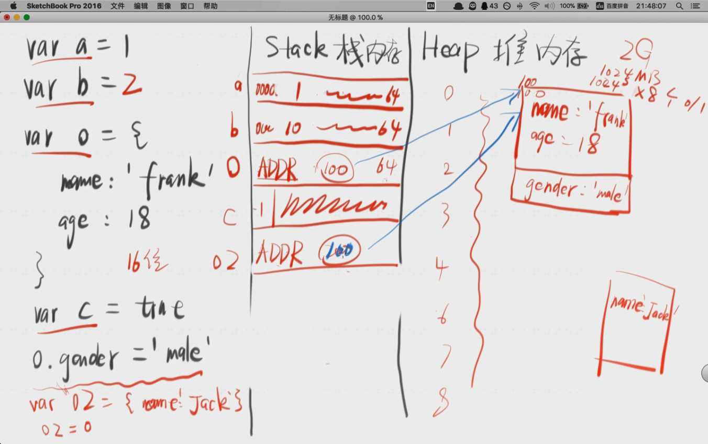


不同数据类型的存储

- 简单数据类型
  - 直接存在Stack栈内存  num|str|symbol|bool|null|undefined
- 复杂数据类型
  - 把Heap堆内存地址存到Stack栈，内容存在Heap堆内存中  object对象


> 变量跟对象的关系是引用关系，没有直接存你，而是存的你的地址。
>
> var obj={name:frank}  //变量obj是对象的引用，obj存的是对象的地址而不是对象的值本身


❗ **切记**

赋值，等于号只做一件事情，就是把等于号右边的东西存到等于号左边的东西里头。

赋值必须先确定等号右边的值，然后再开始赋值。


例子：

var a = {name:‘a’};

b = a;

b = {name:‘b’};

console.log(a.name); //画内存图


将新对象赋给b 改的是b存的地址，而不会改heap中原有的内容

将新数字(或其他基本类型)赋给b 则b位置存的地址会被新的值覆盖掉


> 几个题目例子，用内存图弄清对象的赋值
>
> `基本类型之间的赋值`
>
> 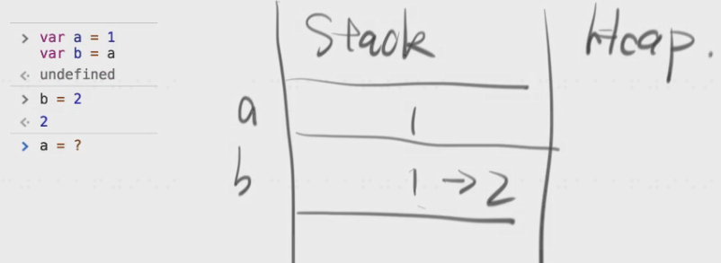
>
> `直接赋值给对象`
>
> 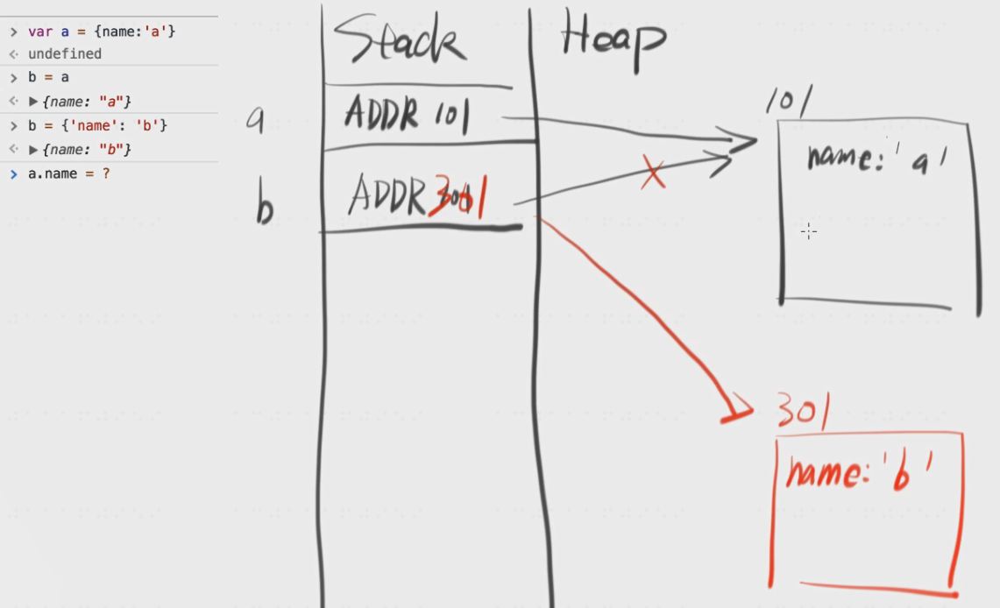
>
> `赋值给对象的属性`
>
> 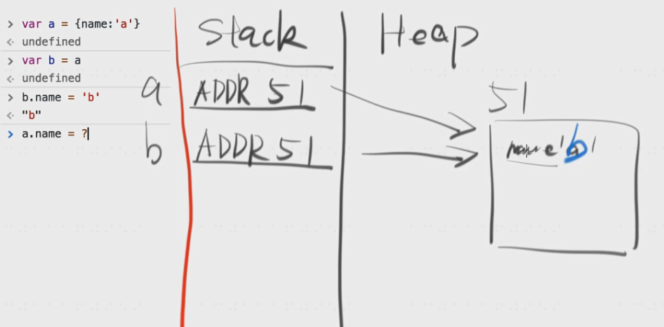
>
> `将基本类型值赋值给原来的对象`
>
> 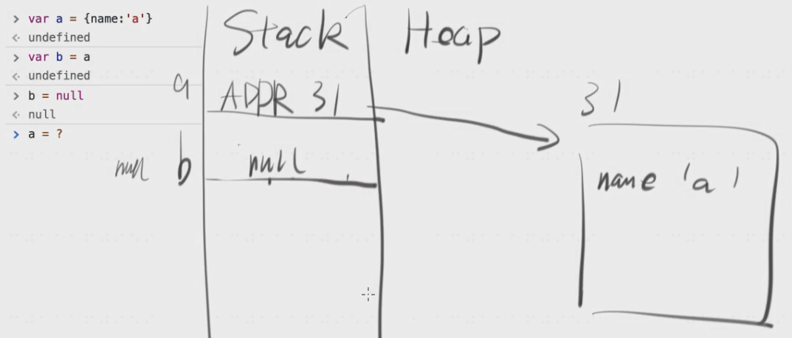


var a ={};a.self=a; a.self.self.self.self可以取到么？ //可以

其实heap里头只有一个对象，从stack找到heap，然后self的值addr33又找到了heap中33号地址位置的东西(就是自己)，然后不停地调自己。

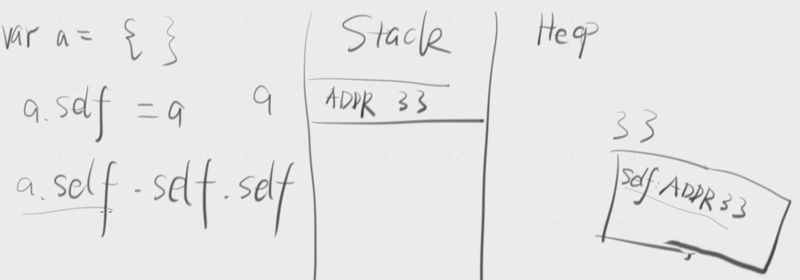


若是var a = {self:a};a.self.self.self //就会报错，

因为赋值操作必须先确定右边的值，而第一次右边的值中的a是undefined 所以 a = {self:undefined};

再来一次a = {self:a};就会变成 a = {self:{self:undefined}},再打一次就会再嵌套一层，不打就停在那一层。


❗ **坑**🕳

alert会调用toString()方法

a.x = a ={n:2};

先确定a，而不是从右往左算到最后才确定a，一开始就确定好了a，然后a={n:2}时会再把a存的地址改了


> 多复习回顾几次:
>
> https://xiedaimala.com/tasks/61db0dcc-71d4-4f0c-822d-5f24ff0dd128/video_tutorials/22579fe7-206c-411f-a8e1-5786501bf481
>
>


---


### GC垃圾回收

##### GC:Garbage Collecation

> **🖊核心**
>
> 如果一个对象没有被引用，他就是垃圾，将会被回收。

有人罩着就不回收，没人罩着就回收。


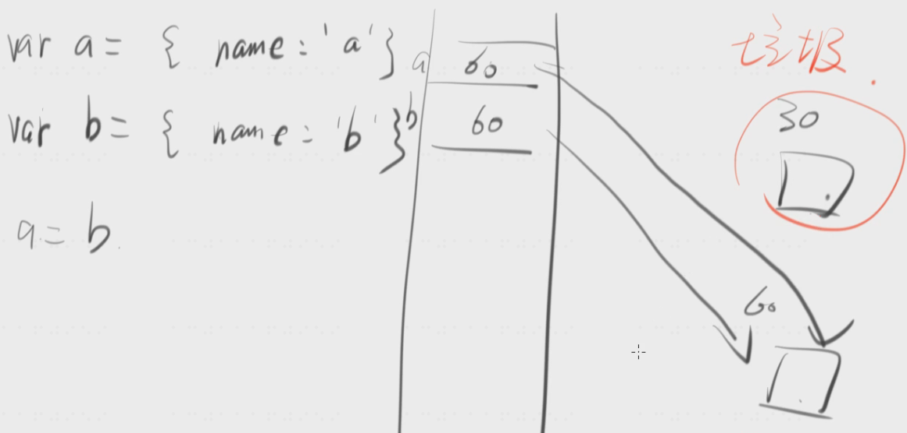


若页面关闭了，document的click事件对应的function全成了垃圾。

但ie有bug，不会回收，可加以下代码解决

window.onunload = function(){document.body.onclick = null;}


题目1

hard1

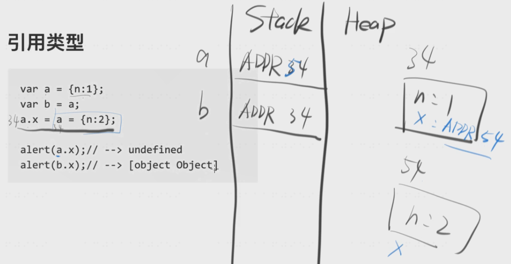

题目2

var fn = function(){}

document.body.onclick = fn

fn = null

问function是不是垃圾

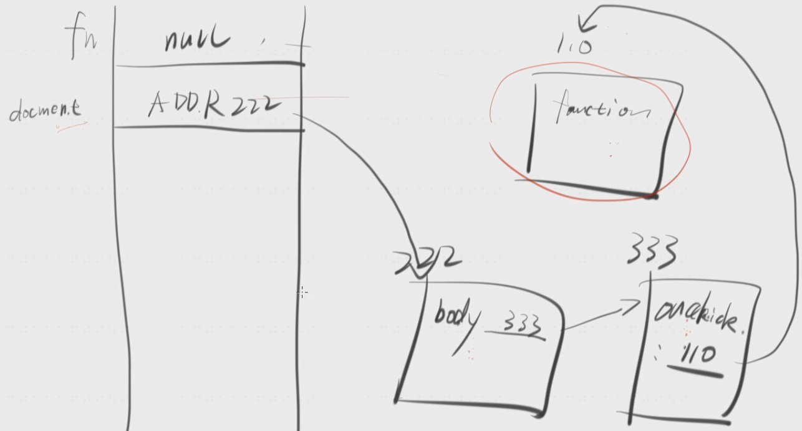


var fn = function(){}

document.body.onclick = fn

fn = null

document.body.onclick = null

问function是不是垃圾

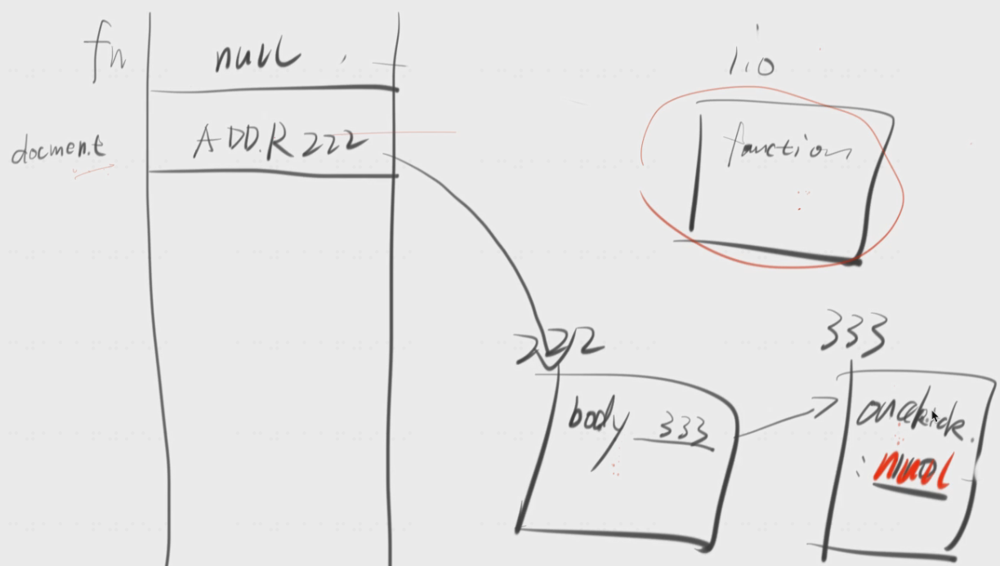


### 深拷贝 VS 浅拷贝


> 深拷贝

var a = 1;

var b = a;

b变不影响a，深拷贝

基本类型的赋值，为深拷贝


> 浅拷贝

var a = {name:‘a’}

var b = a

b.name = ‘b’

a.name //也是b

b变a也变，浅拷贝


对象的深拷贝，见下图

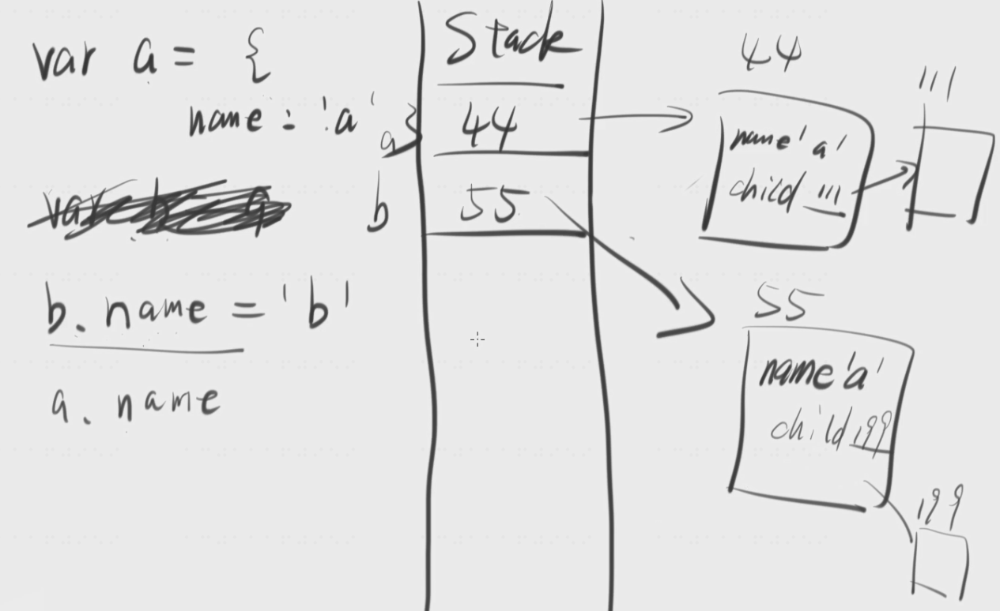


深拷贝如何实现，请听下回分解