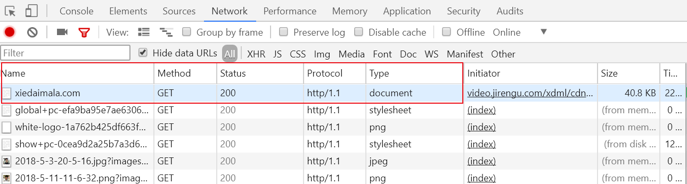
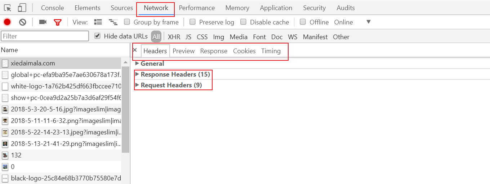
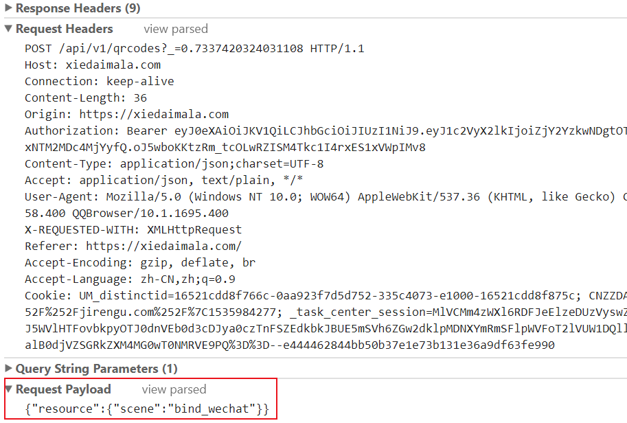
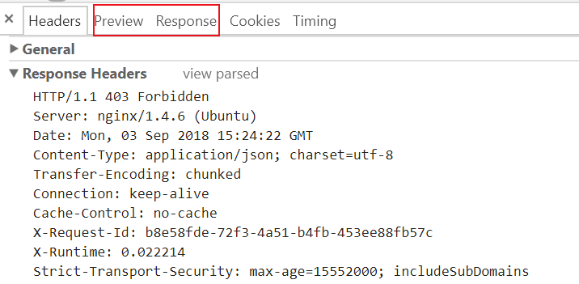

# HTTP相关姿势

==HTTP 的作用就是指导浏览器和服务器如何进行沟通。==

> **curl命令**

curl命令是一个利用URL规则在命令行工作的文件传输工具。

支持文件的上传和下载。

🔔 `curl是发起一个请求`

| 常用命令     | 功能                                                 |
| ------------ | ---------------------------------------------------- |
| -X/--request | 指定请求方式，GET/POST/PUT/PATCH/DELETE/HEAD/OPTIONS |
| -H/--header  | 自定义头信息传递给服务器                             |
| -d/--data    | HTTP POST方式传送数据                                |
| -v/--verbose | 详细输出，包含请求和响应的头部                       |
| -s/--silent  | 静默模式，不显示错误和进度                           |
| -O/          | 从远程下载文件到当前目录，保留原文件名               |

命令使用举:chestnut:

- curl -X POST https://www.baidu.com 

  不带-X 默认为GET请求方式

---

- curl -X POST -H “superman285:xxx” https://www.baidu.com

---

- curl -X POST -v -H “superman285:xxx” https://www.baidu.com

- curl -X POST -v -s -H “superman285:xxx” https://www.baidu.com

请求内容为

> \> POST / HTTP/1.1
> \> Host: www.baidu.com
> \> User-Agent: curl/7.59.0
> \> Accept: \*/*
> \> superman285:xxx
>
> \>

响应内容为

> < HTTP/1.1 302 Found
> < Connection: Keep-Alive
> < Content-Length: 17931
> < Content-Type: text/html
> < Date: Mon, 03 Sep 2018 16:36:53 GMT
> < Etag: "54d97485-460b"
>
> \* Server bfe/1.0.8.18 is not blacklisted
> < Server: bfe/1.0.8.18
> <
> 网页html内容...

---

- curl -X POST -d "123456789" -v -s -H “superman285:xxx” https://www.baidu.com

请求内容为

> \> POST / HTTP/1.1
> \> Host: www.baidu.com
> \> User-Agent: curl/7.59.0
> \> Accept: \*/*
> \> superman285:xxx
>
> \> Content-Length: 9
>
> \> Content-Type: application/x-www-form-urlencoded
>
> \>
>
>
>
>
>
>
>
>
>
> 1234567890

响应内容为

> < HTTP/1.1 302 Found
> < Connection: Keep-Alive
> < Content-Length: 17931
> < Content-Type: text/html
> < Date: Mon, 03 Sep 2018 16:36:53 GMT
> < Etag: "54d97485-460b"
>
> \* Server bfe/1.0.8.18 is not blacklisted
> < Server: bfe/1.0.8.18
> <
> 网页html内容...

---

curl -O https://ss0.bdstatic.com/img/logo_baidu.com

---

:cyclone: **注意**

curl -s -v -H "superman285:666" https://xiedaimala.com/search?keyword=scss&type=courses&page=1

如果在命令行中输入这行命令，只能识别一个查询参数keyword=scss，解决方法：

- 转义： https://xiedaimala.com/search?keyword=scss\&type=courses\&page=1
- 加双引号：“https://xiedaimala.com/search?keyword=scss&type=courses&page=1”

> 参考博客园-mofy文章 https://www.cnblogs.com/z-books/p/6228284.html

#### 请求与响应的构成

---

> HTTP请求和HTTP响应都包含4部分

###### HTTP请求

1. 请求方法 路径 协议/版本号
2. 请求头
3. 空行
4. 请求数据正文

###### 请求具体格式

- 第1部分：动词 路径 协议/版本号

- 第2部分：key1:value1
- 第2部分：key2:value2
- 第2部分：key3:value3
- 第2部分：Content-Type
- 第2部分：Host
- 第2部分：User-Agent
- 第3部分：一个回车(\n)
- 第4部分：要上传的数据

请求最多包含4部分，最少包含3部分，第4部分**可为空**。

💡 **请求方法动词有：**

==GET== **|** ==POST== **|** ==PUT== **|** ==PATCH== **|** ==DELETE==

💡 路径默认为“/”,路径包括==查询参数==，但不包括==锚点==。

✔ /search?keyword=SASS&type=courses&page=1

× /search?keyword=SASS&type=courses&page=1#2

💡 第2部分Content-Type标注了第4部分内容的格式

💡 要上传的数据最常见的是用户名和密码

💡 查看第四部分内容在FormData或Request Payload中。

###### HTTP响应

1. 状态行 「协议/版本号 状态码 状态描述」
2. 响应头
3. 空行
4. 响应数据正文

###### 响应具体格式

- 第1部分：协议/版本号 状态码 状态解释

- 第2部分：key1: value1

- 第2部分：key2: value2

- 第2部分：Content-Length

- 第2部分：Content-Type(标注第4部分格式) 

          例如text/html | application/javascript | json | image/png

- 第3部分：一个回车(\n)

- 第4部分：要下载的内容

💡 第2部分Content-Type标注了第4部分内容的格式

💡 第2部分中的Content-Type遵循MIME规范

###### 状态码

- 1xx 不常用
- 2xx 表示成功
- 3xx 表示滚吧    301表示搬家了永远不回来了,302表示临时外出可能以后还回来
- 4xx 表示你错了  (**访问者**出错了，例如地址打错了等)
- 5xx 表示好吧,我错了    (**服务器**出错了，例如服务器挂了、服务器停止了) 

==状态码是服务器对浏览器说的话，需要记住。==

**常见状态**

- 200 OK 客户端请求成功
- 301：Move Permanently 永久重定向，请求的资源已被永久的移动到新URI
- 302：Found 临时重定向 与301类似，但资源只是临时被移动
- 400 Bad Request 客户端请求的语法错误，服务器无法理解
- 403 Forbidden 服务器拒绝执行此请求
- 404 Not Found 请求的资源不存在，例如，输入了错误的URL
- 500 Internal Server Error 服务器内部错误，无法完成请求
- 502 服务器网关错误，收到无效响应

请求和响应的第一部分都含有 `协议/版本号`

> **查看请求和响应的方法**

打开浏览器开发者工具Developer Tools，Network选项卡，右键添加Method页签(如果没有的话。)

Method页签看GET或POST方法，status看状态码，protocol看协议/版本号，type看类型可以为document、script、png等

然后在Name页签点一下你想要查看的URI

在右侧弹出页的Headers,有General、Response Headers、Request Headers等信息

General

> Request URL: https://xiedaimala.com/
>
> Request Method: GET
>
> Status Code: 200 OK
>
> Remote Address: 114.215.175.213:443
>
> Referrer Policy: no-referrer-when-downgrade

在Response Headers或Request Headers想查看响应或请求详情，关键来了：

`点击view source`

`点击view source`

`点击view source`

Response Headers/Request Headers**右侧浅色小字**

这儿可以==查看到请求|响应内容的前3部分==

:cyclone:请求的第4部分数据在Form Data或Request Payload中查看 [*GET请求没有第4部分数据*]

---

:cyclone: 响应的第4部分数据在Preview或Response的tab中查看

---

